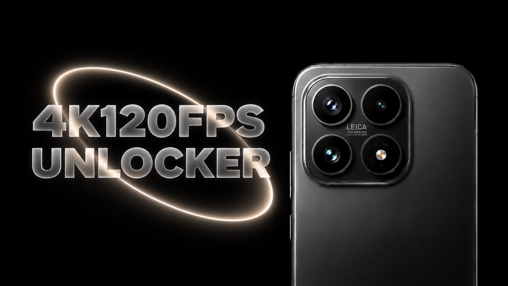

# Xiaomi17 4K120

KernelSU / Magisk module.

Adds 4K120 video recording to the stock Xiaomi 17 camera. Compatible with pudding and the supported sunny OVX9500 sensor table.

Tested only on HyperOS 3.0.315.0 CN (Android 16). Not tested on Android 17.

## Install

[Download from releases](https://github.com/Picters/Xiaomi17-4K120-Unlocker/releases), install it through your root manager and reboot.

To restore stock, disable or remove the module and reboot.
